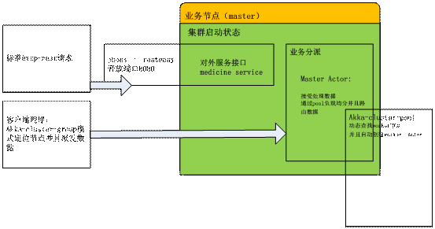
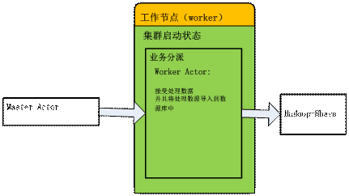
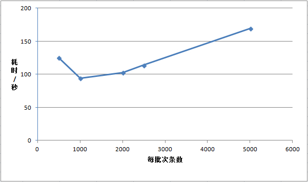

medicine-cloud
==============

系统建立在akka 2.3.8版本基础之上。
对外提供restful访问(jboss-resteasy)，对外提供批量数据加载，和数据展示功能。
系统采用akka-cluster构建， 工作节点使用cluster-pool方式动态创建。

-------------------------------------------------------------

大并发
实时数据处理解决方案：

<o:p>&nbsp;</o:p>

<![if !supportLists]>1.&nbsp;&nbsp;&nbsp;&nbsp;&nbsp;&nbsp;
<![endif]>架构

整体系统采用分布式结构搭建，系统功能包括：

<![if !supportLists]>&Oslash;&nbsp; <![endif]>对外提供海量数据的载入，测试结果会看到具体指标项

<![if !supportLists]>&Oslash;&nbsp; <![endif]>海量数据查询功能

<o:p>&nbsp;</o:p>

此外系统本身具有如下特点：

<![if !supportLists]>&Oslash;&nbsp; <![endif]>可扩展性，集群上面的节点有自定义的角色划分，并且各个角色可以实现动态搜索，
根据业务量增大或者缩小，可以动态添加或者减少节点数量。

<![if !supportLists]>&Oslash;&nbsp; <![endif]>负载均衡：这里负载均衡的目的是为了减少单台服务器压力过大（尤其在网卡，内存方面）的情况。这里提供两种负载均衡：第一种针对后端倒入数据的节点：采用均衡 (默认是roundrobin)方式动态发现，分派预定块数据。第二种针对前端结构请求端节点，也是采用均衡 (默认是roundrobin)方式动态发起请求。

<![if !supportLists]>&Oslash;&nbsp; <![endif]>故障转移：针对后端数据导入节点，系统采用定义了物理度量值功能，如果单节点不符合条件（比如down机，或者正在处理数据导致cpu，网络，内存等饱和）分发节点会动态选择其他候选节点来处理。

<o:p>&nbsp;</o:p>

<o:p>&nbsp;</o:p>

下图是系统的业务导向：

<!--[if gte vml 1]><v:shapetype id="_x0000_t75" coordsize="21600,21600"
 o:spt="75" o:preferrelative="t" path="m@4@5l@4@11@9@11@9@5xe" filled="f"
 stroked="f">
 <v:stroke joinstyle="miter"/>
 <v:formulas>
  <v:f eqn="if lineDrawn pixelLineWidth 0"/>
  <v:f eqn="sum @0 1 0"/>
  <v:f eqn="sum 0 0 @1"/>
  <v:f eqn="prod @2 1 2"/>
  <v:f eqn="prod @3 21600 pixelWidth"/>
  <v:f eqn="prod @3 21600 pixelHeight"/>
  <v:f eqn="sum @0 0 1"/>
  <v:f eqn="prod @6 1 2"/>
  <v:f eqn="prod @7 21600 pixelWidth"/>
  <v:f eqn="sum @8 21600 0"/>
  <v:f eqn="prod @7 21600 pixelHeight"/>
  <v:f eqn="sum @10 21600 0"/>
 </v:formulas>
 <v:path o:extrusionok="f" gradientshapeok="t" o:connecttype="rect"/>
 <o:lock v:ext="edit" aspectratio="t"/>
</v:shapetype><v:shape id="_x0000_i1025" type="#_x0000_t75" style='width:276.75pt;
 height:225pt' o:ole="">
 <v:imagedata src="doc/imgs/image001.emz" o:title=""/>
</v:shape><![endif]--><![if !vml]><![endif]><!--[if gte mso 9]><xml>
 <o:OLEObject Type="Embed" ProgID="Visio.Drawing.11" ShapeID="_x0000_i1025"
  DrawAspect="Content" ObjectID="_1482908633">
 </o:OLEObject>
</xml><![endif]-->

客户端可以发起标准的http-rest请求来调用系统，此外也可以使用客户端程序来调用系统。在部署架构上来讲，如果使用http-rest方式，需要在分布式系统前段再部署一层http负载均衡软件（比如nginx,haproxy等等）。如果使用客户端程序的话那么不需要加装http负责均衡层，客户端程序本身自带负载均衡策略。

数据库端我们目前采用hadoop-hbase作为存储解决方案，可以使用其它系统动态替换。

<o:p>&nbsp;</o:p>

<o:p>&nbsp;</o:p>

<o:p>&nbsp;</o:p>

<o:p>&nbsp;</o:p>

系统分为以下4种角色：

<!--[if gte vml 1]><v:shape id="_x0000_i1026" type="#_x0000_t75"
 style='width:4in;height:204pt' o:ole="">
 <v:imagedata src="doc/imgs/image003.emz" o:title=""/>
</v:shape><![endif]--><![if !vml]><![endif]><!--[if gte mso 9]><xml>
 <o:OLEObject Type="Embed" ProgID="Visio.Drawing.11" ShapeID="_x0000_i1026"
  DrawAspect="Content" ObjectID="_1482908634">
 </o:OLEObject>
</xml><![endif]-->

系统角色划分

<b style='mso-bidi-font-weight:
normal'>备注：各个角色的之间通讯都使用异步通讯方式，极大提升了cpu</b><b
style='mso-bidi-font-weight:normal'>的利用率以及系统的吞吐率<o:p></o:p></b>

<![if !supportLists]>&Oslash;&nbsp; <![endif]>业务节点(master) ：是系统的业务前段，负责对外接受数据，分派任务给工作节点。

这里简单图示下master节点：

<!--[if gte vml 1]><v:shape
 id="_x0000_i1027" type="#_x0000_t75" style='width:414.75pt;height:218.25pt'
 o:ole="">
 <v:imagedata src="doc/imgs/image005.emz" o:title=""/>
</v:shape><![endif]--><![if !vml]><![endif]><!--[if gte mso 9]><xml>
 <o:OLEObject Type="Embed" ProgID="Visio.Drawing.11" ShapeID="_x0000_i1027"
  DrawAspect="Content" ObjectID="_1482908635">
 </o:OLEObject>
</xml><![endif]-->

<o:p>&nbsp;</o:p>

<![if !supportLists]>&Oslash;&nbsp; <![endif]>工作节点(worker) ：是系统的具体工作节点，负责处理具体的业务，这里当然就是导入数据啦。

这里简单图示下worker节点：

<o:p>&nbsp;</o:p>

<!--[if gte vml 1]><v:shape id="_x0000_i1028" type="#_x0000_t75"
 style='width:323.25pt;height:181.5pt' o:ole="">
 <v:imagedata src="doc/imgs/image007.emz" o:title=""/>
</v:shape><![endif]--><![if !vml]><![endif]><!--[if gte mso 9]><xml>
 <o:OLEObject Type="Embed" ProgID="Visio.Drawing.11" ShapeID="_x0000_i1028"
  DrawAspect="Content" ObjectID="_1482908636">
 </o:OLEObject>
</xml><![endif]-->

<![if !supportLists]>&Oslash;&nbsp; <![endif]>管理节点(seed)：集群内部管理节点，必须存在一个以上的seed节点，这样集群才能正常运行。运维人员可以查看该节点数据来观察集群的健康状况。

<![if !supportLists]>&Oslash;&nbsp; <![endif]>监控节点(monitor)：集群管理节点，可以监控集群节点的状况（包括：活动，停顿，在工作等等情况）系统默认采用日志输出的方式，但也可以接入第三方软件实现动态监控。

<b style='mso-bidi-font-weight:
normal'>备注：以上角色定义都是自定义，可以根据需要自定义其它角色</b>

<o:p>&nbsp;</o:p>

<o:p>&nbsp;</o:p>

<![if !supportLists]>2.&nbsp;&nbsp;&nbsp;&nbsp;&nbsp;&nbsp;
<![endif]>测试结果

<!--[if gte vml 1]><v:shape
 id="图片_x0020_7" o:spid="_x0000_i1029" type="#_x0000_t75" style='width:450.75pt;
 height:266.25pt;visibility:visible;mso-wrap-style:square'>
 <v:imagedata src="doc/imgs/image009.jpg" o:title="GE[QTI5Q~$)34~UQ}TW8N)1"/>
</v:shape><![endif]--><![if !vml]><![endif]><o:p></o:p>

这里展示的使用20万测试数据（根据业务需要的模拟数据）的测试结果，测试方式采用客户端http-rest方式，分别采用每500，1000，2000，2500，5000一个数据包发送系统对外总耗时情况。从图上看出1000条批次的耗时100秒左右是最优的。<o:p></o:p>

<o:p>&nbsp;</o:p>

<o:p>&nbsp;</o:p>

-------------------------------------------------------------------------

scale-out模式下配置的启动参数如下：

java -Xms2048m -Xmx2048m -XX:PermSize=128m -XX:MaxPermSize=256m -XX:+PrintGCDetails -XX:+PrintGCDateStamps -XX:+PrintGCTimeStamps  -verbose:gc  -Xloggc:logs/gc_master.log -jar medicine-master.jar 10.1.65.104 2570 > master.log &

java -Xms2048m -Xmx2048m -XX:PermSize=128m -XX:MaxPermSize=256m -XX:+PrintGCDetails -XX:+PrintGCDateStamps -XX:+PrintGCTimeStamps  -verbose:gc  -Xloggc:logs/gc_seed.log  -jar medicine-seed.jar 10.1.65.106 2551 > seed.log &

java -Xms2048m -Xmx2048m -XX:PermSize=128m -XX:MaxPermSize=256m -XX:+PrintGCDetails -XX:+PrintGCDateStamps -XX:+PrintGCTimeStamps  -verbose:gc  -Xloggc:logs/gc_seed.log  -jar medicine-seed.jar 10.1.65.107 2551 > seed.log &

java -Xms2048m -Xmx2048m -XX:PermSize=128m -XX:MaxPermSize=256m -XX:+PrintGCDetails -XX:+PrintGCDateStamps -XX:+PrintGCTimeStamps  -verbose:gc  -Xloggc:logs/gc_worker.log  -jar medicine-worker.jar 10.1.65.106 2580 > worker.log &

java -Xms2048m -Xmx2048m -XX:PermSize=128m -XX:MaxPermSize=256m -XX:+PrintGCDetails -XX:+PrintGCDateStamps -XX:+PrintGCTimeStamps  -verbose:gc  -Xloggc:logs/gc_worker.log  -jar medicine-worker.jar 10.1.65.107 2580 > worker.log &

